# The Ultimate Filament Tuning Guide

### How to tune 3D printer filaments to perfection!

This guide details how I tune in my 3d printing filaments. It takes approximately 80 grams of filament and a few hours of time, including print times. If your printer profiles are tuned in properly, following this guide will give you the best settings possible for your various filaments. This is **NOT** a guide on how to fine tune your printer's motion system and settings, for that, please see [Ellis' Excellent Print Tuning Guide](https://ellis3dp.com/Print-Tuning-Guide/). Both Ellis' and myself's Flowrate Test work, although I believe that my method gives more accurate results. Whichever you would like to use is up to you.

### Things to Know

This guide assumes that you are using [Klipper firmware](https://www.klipper3d.org/), but everything except for the probe calibration method is transferrable to any other 3D printer firmware. It also assumes that your are using [PrusaSlicer](https://www.prusa3d.com/page/prusaslicer_424/), however most, if not all, of these settings can be found in other slicers, although they may have slightly different names. Lastly, it assumes that you know how to slice for your machine and have a general knowledge of what the settings in your slicer modify. There is a plethora of knowledge online if you are confused. I highly recommend just looking up whatever you would like to know that isn't explained here.

All needed models and .3mf files are included in the [Tuning Models](Tuning-Models) folder. The guide will detail which file to use for each test. I highly recommend following the [Per Filament Steps](#per-filament-steps) section of the guide in order, as it will give the least variation in results, but you may follow this guide in whatever order you choose.

If you notice slight problems that can be attributed to a wrong interpretation of a test's results, I recommend finishing the entirety of the [Per Filament Steps](#per-filament-steps) section, and then going back and fixing the issue. Doing this prevents any untuned variables from skewing your retests, and means that once you fix the problem, everything is done and you can move on to printing!

# How to import 3MF files

Import the file into PrusaSlicer by **dragging and dropping it into the program**. If you use the `"Import Project..."` or `"Add..."` buttons, it will import the file with my personal profiles, which is a major headache. When the window shown below appears, make sure to select `"Import 3D models only"`. This will prevent you from importing my personal profiles and, again, will save a lot of headache getting rid of those.

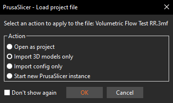

# Feedback and Additions

This guide was created through my years of experience and the accumulated knowledge of this community. That being said information can be wrong, so if there is an issue with this guide, please open an issue on this repo! I'll get back to you and fix it as soon as I can. It doesn't matter if its a typo or an entirely wrong section, if something's not right, I'd like to make sure it's made right. 

If there is something that you think should be added to this guide, please submit a pull request or an issue! For example, I've been looking for good ways to tune the `Dynamic Fan Speeds` and `Enable Fan if Layer Print Time is Below:` settings!

Lastly, if you use this guide and find it helpful, please give it a star! It helps me know that other's find this guide useful and would benefit from it being updated whenever I figure out something new.

# THE GUIDE

- [One-Time Steps](#one-time-steps)
    - [First Layer Calibration](#first-layer-calibration)
    - [Elephant's Foot Compensation](#elephants-foot-compensation)
    - [Infill/Perimeter Encroachment Test](#infillperimeter-encroachment-test)
    - [Bridge Flow Rate Calibration Test](#bridge-flow-rate-calibration-test)

- [Per Filament Steps](#per-filament-steps)
    - [Temperature Test](#temperature-test)
    - [Volumetric Flowrate Test](#volumetric-flowrate-test)
    - [Linear Advance Test](#linear-advance-test)
    - [Flowrate Test](#flowrate-test)
    - [Retraction Test](#retraction-test)
    - [Fan Speed Test](#fan-speed-test)
    - [Minimum Layer Time Test](#minimum-layer-time-test)
    - [Minimum Layer Speed Test](#minimum-layer-speed-test)
    - [Validate Tuning Results](#validate-results)

- [Optional Steps](#optional-but-still-recommended-steps)
    - [Material Expansion/Contraction Calibration](#material-expansioncontraction-calibration)
    - [Retract/Unretract Speeds](#retraction-and-unretraction-speed-tuning)
    - [TMC Register Tuning](#tmc-register-tuning)
    - [VFA Testing and Tuning](#vfa-tuning-tests)

- [Troubleshooting Results](#troubleshooting-results)
    - [Validation Model Issues](#validation-model-issues)

# One-Time Steps

## **First Layer Calibration**

If using an automatic bed probe, first follow the klipper docs for [Probe Calibration](https://www.klipper3d.org/Probe_Calibrate.html).

- **Note:** The following is less of a one-time step and more of a "you should do this biweekly" step.

If your printer has bed leveling springs, run the `BED_SCREWS_ADJUST` command and use either a 0.10 mm feeler gauge or a sheet of A4 paper to adjust the bed to be in parallel with the gantry. Do this even if you have an automatic leveling probe installed.

When the above have been completed, make a cube in your slicer. Scale it to approximately half of the total size of your bed, then unlock the scaling and change the z height to be equal to the height of your first layer. Run the print while sitting infront of your printer. As the print progresses, use the babystepping feature found in your web interface to iteratively raise or lower the bed until your layer lines look perfect. Once you reach a point you are happy with, you can either let the print complete or cancel the print. Pull the layer of filament off of the bed and inspect the underside to make sure that your final adjustment is correct. Run `Z_OFFSET_APPLY_PROBE` then `SAVE_CONFIG` to save your new z-offset.

## **Elephant's Foot Compensation**
This isn't so much of a step as it is something that I just recommend doing. Elephant's foot compansation shrinks the first layer by the amount specified in the x and y axes so that your first layer squish doesn't artifically create a bigger-than-wanted footprint on the bed. I set this value at 0.1 mm to start. Typically it sits somewhere between 0 mm and 0.2 mm. I wouldn't recommend going above 0.2 mm unless you have a leveling problem, in which case you should redo the above step. If you make the elephant's foot compansation value too big, you may cause the first layer to be too small, preventing good layer stacking on top of it. You can read more about this feature [here](https://help.prusa3d.com/article/elephant-foot-compensation_114487).

## **Infill/Perimeter Encroachment Test**
- Uses [Perimeter-Overlap-Test](Tuning-Models/Perimeter-Overlap-Test.3mf)

Import [Perimeter-Overlap-Test](Tuning-Models/Perimeter-Overlap-Test.3mf) into your slicer. Make sure that there is at least two layers of infill between the top and bottom solid layers. Print out the file and check for gaps and pin holes at the edge of the top layer. The best value for your Infill/Perimeter overlap is where these gaps and holes disappear, but there is not over extrusion in the corners of the cube. The screenshot below shows what Perimeter Overlap Percentages each test model is printed at.

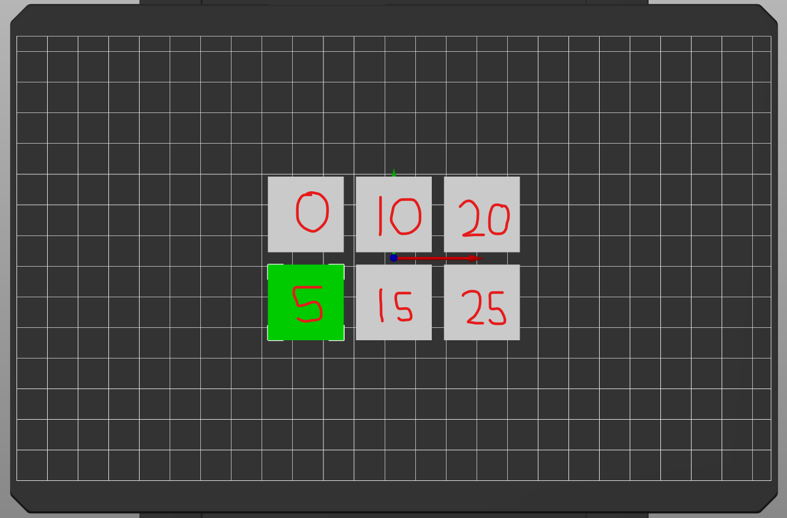

Click here to See Example

Here is an example of perimeter encroachment that I printed on my heavily modified Ender 3. The values used are the same as the screenshot from the slicer.

- A symptom of too little perimeter encroachment can be found in the 0% and 5% squares.
    - The pin holes at the edges of the top layer indicate that not enough filament is being extruded to properly bond to the walls.

- The 10% through 25% squares all show signs of too much perimeter encroachment.
    - The point where the top layer meets the walls causes a buldge at that contact point, rasing the edge of the top surface.
    - The beginning corner of the higher percentage squares can be seen to be severely over extruded. The 10% square has this also, but that is because the print ended in that spot.
    - It may be hard to see on camera, but the 20% and 25% squares also have ridges on their top surfaces that correspond to the extrusion lines on that surface, which is a result of over extrusion

From this test I can deduce that my ideal perimeter encroachment lies somewhere between 5% and 10%. To find this ideal encroachment, you can either change the values of the squares and run the test again (i.e. 5%, 6%, 7%, etc...), or you can change it as you do prints and finalize it when the top surface of those prints looks ideal.

Personally, I would recommend changing it by small amounts as you do prints. It won't affect your prints much, and will save you time and filament on another test print.

**Note**: Bigger nozzles usually have more difficulty closing these gaps. I recommend checking [this section of Ellis' print tuning guide](https://ellis3dp.com/Print-Tuning-Guide/articles/infill_perimeter_overlap.html) for more solutions.

## **Bridge Flow Rate Calibration Test**
- Uses [Bridge-Flow-Tuning](Tuning-Models/Bridge-Flow-Tuning.3mf)

This calibration should only be done after you have calibrated your fan speed and have figured out what a good bridging speed for your printer is. Make sure that your bridging still suffers even on 100% fan speed before using this feature. If you are satisfied with the bridging performance and dimensional accuracy of holes, skip this step, otherwise do the following.

Import [Bridge-Flow-Tuning](Tuning-Models/Bridge-Flow-Tuning.3mf) into your slicer. This file will print a group of the test model with bridge flow rates ranging from a bridge flow ratio of 1.0 to 0.4. The screenshot below shows the ratios that each test model is printed at.

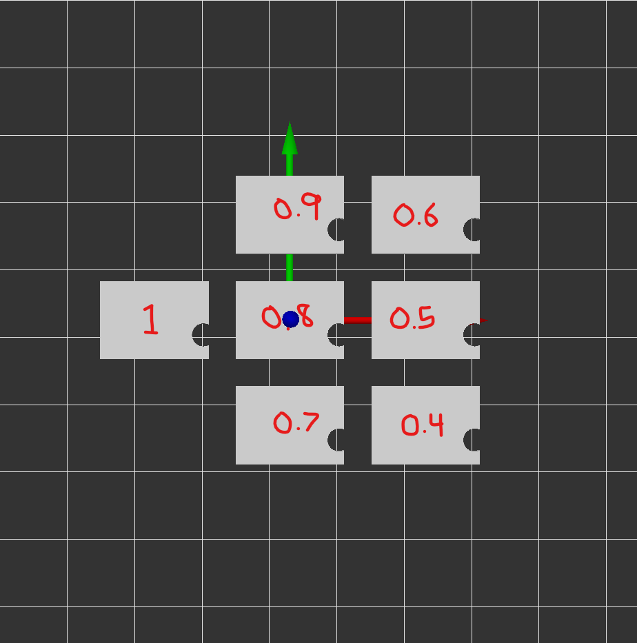

Once these are printed, you are looking for the highest flow ratio that does not produce drooping at the top of the holes. You want to adjust this ratio as little as possible, the closer you can stay to a ratio of 1.0, the better. Once you have found your ideal bridge flow ratio, you can input the setting in the location shown in the screenshot below.

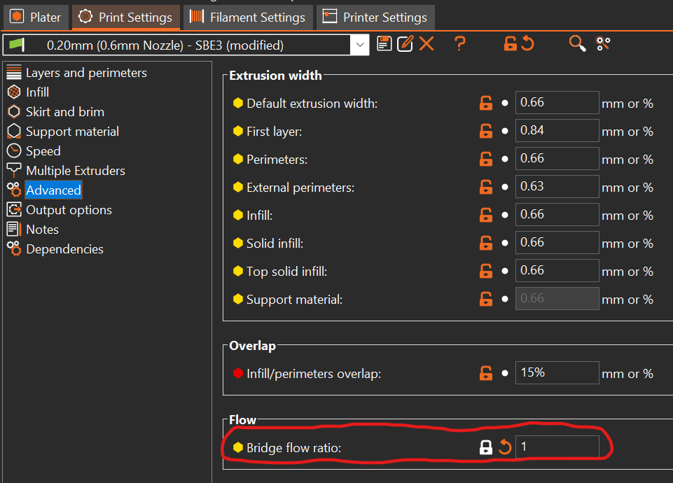

Your final result should look something like this:

Click here to See Pictures

Here are a few pieces of the bridge flowrate test that I printed on my heavily modified Ender 3.

- This example was printed with a 1.0 ratio.
    - The top of the hole shows plastic that is severely protruding into the hole. This indicates that the flowrate is too high and needs to be lowered.

- This example was printed with a 0.4 ratio.
    - At the top of the hole, the bridging lines seem to be barely touching each other and in some cases being stretched thin near their ends. This indicates that the flowrate is too low and needs to be raised.

- This example was printed with a 0.7 ratio.
    - The bridge lines at the top of the hole are nice and even, touching their neighbors without protruding into the hole. This is the correct flowrate for this printer and infact is the flowrate I use for a 0.20 mm layer height, which is what is pictured.

- **Note:** It is very hard to take pictures of this feature because of the size of the pieces and lighting. I promise that the differences between the flowrate ratios are much more clear when doing this test in real life.

**Note**: You will have to test this for every layer height profile that you have for your printer. Since different volumetric amounts are output at different layer heights, the amount of bridge flow rate reduction needed will vary. Generally, more is needed for larger layer heights, and less is needed for smaller layer heights. You are trying to get away with as little flow reduction as possible. Going too low on the multiplier may cause poor support for the layers on top of it or, in extreme cases, a breaking of the filament flow, causing the bridge to fail entriely (you will have to make a conceited effort to achieve the latter).

# Per Filament Steps

## **Temperature Test**

**Note:** For this test, you will need to unlatch your extruder in some way. Whether that be removing the tension knob on a bondtech gear set or holding the lever arm open on a Mk8 style extruder. Essentially you don't want the extruder gear(s) touching the filament in anyway, if possible.

Read the manufacture's rated temperatures for your filament. Choose a starting point that is 10°C below the lowest temperature, and an ending point that is 10°C higher than the highest temperature. For example, a range of `190°C - 220°C` would mean that you want to run the hotend through a temperature range of `180°C - 230°C`. Set your hotend to your starting point and let it stabilize.

Unlatch your extruder and grip the filament with your hand. The goal is to push filament through the extruder with as constant of a pressure as possible. Once in position, set the temperature of your hotend to your ending point, and start pushing. Keep a close eye on the temperature as it rises and as you keep pushing.

You will notice that the filament starts moving noticably faster when the hotend hits certain temperatures. Make a note of those points in your head as you push the filament. Once the hotend reaches your chosen ending point, you can stop pushing the filament. Turn your hotend heater off and relatch your extruder.

Write down the tempatures where you noticed the resistance on the filament decrease. Generally, picking a temperature in the middle of the manufacture's rated temperatures is a good all around setting. Avoid the trap of setting the filament temperature as low as possible, as it can lead to extruder skipping and extruded lines that were not fully melted in the hotend.

Continuing the example from earlier, say there's a filament with a rated temperature range of `190°C - 220°C`. I'll set my hotend to run through a range of `180°C - 230°C` for this test. I do the test as described above, and I find that the points at which the resistance on the filament dropped were `190°C, 210°C, and 230°C`. Wanting a good overall setting, I'll choose `210°C` as the temperature for this filament.

### Good Rules of Thumb

- Generally, the best temperature is somewhere in the middle of the recommended temperatures on a standard 0.4mm brass nozzle, however, this is not a steadfast rule. Hardened steel nozzles tend to need to run about 10-15 C hotter than brass to compensate for their lower heat transfer coefficient.

- Adding 5°C to your chosen temperature can be beneficial if you tend to prefer setting your filaments to lower temperatures. It will prevent your filament from being too resistive to extrusion while still maintaining the qualities that you are looking for.

- If pushing for high volumetric flow rates, chosing the highest temperature where the resistance on the filament dropped is the best option for this test. Keep in mind that doing this will cause lower volumetric flow rate areas in your models to string more heavily.

## **Volumetric Flowrate Test**

- Uses [Volumetric-Flow-Test-RR.3mf](Tuning-Models/Volumetric_Flow_Test.3mf)
- This test was designed by Yathani on Printables! Go check it out here: [Volumetric Flow Test for RatRig V-CORE3](https://www.printables.com/model/328223-volumetric-flow-test-for-ratrig-v-core3)

This test works by increasing your printer's feedrate by 100% every 5 mm in z-height. For a standard flow hotend, you'll want to step up in 2 mm3/s increments; for high-flow hotends, you'll want to step up 2-5 mm3/s increments, depending on the advertised maximum flowrate of your hotend. The final volumetric flowrate will be 12 times the starting flowrate.

Volumetric flow rate can be calculated as:

$$VFR=Layer height * Layer width * Layer Speed$$

Because layer height and layer width stay constant during a print, we want to change the layer speed of the external perimeters to control the volumtric flowrate of the test. Rearranging the equation, and using 2 mm3/s as the target volumtric flow rate, we can find our needed external perimeter speed for this print.

$$Layer Speed=2/(Layer width*Layer height)$$

Using a 0.4mm layer width with a 0.2mm layer height as an example, we obtain this answer

$$Layer Speed=2/(0.4*0.2)$$

$$Layer Speed=25mm/s$$

Turn on Spiral Vase mode, set your external perimeter speed to the value you obtain, and run the print. If you feel that the final volumetric flow rate is far past the limit of your hotend, you can scale the model in z-height only in PrusaSlicer to obtain a lower final volumetric flow rate.

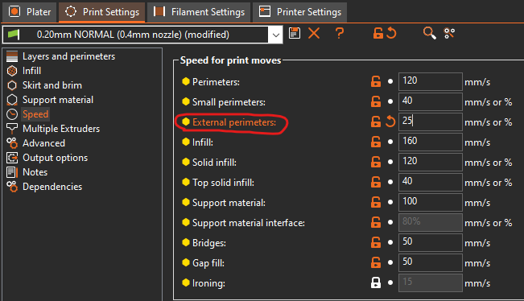

Once this test is completed and your printer is cooled, I highely recommend either restarting the printer, or, if using Klipper, issuing a `FIRMWARE_RESTART` command.

## **Linear Advance Test**
- Follow [Ellis' Print Tuning Guide](https://ellis3dp.com/Print-Tuning-Guide/) for this and use [his online calibration tool to generate your gcode.](https://ellis3dp.com/Pressure_Linear_Advance_Tool/) Do interations down to 0.001 for Direct Drive extruders, and down to 0.01 for Bowden extruders.
- [Ellis' Pressure Advance Documentation](https://ellis3dp.com/Print-Tuning-Guide/articles/pressure_linear_advance/pattern_method.html)
- [Klipper Pressure Advance Documentation for Extra Information](https://www.klipper3d.org/Pressure_Advance.html)

- **Note:** If flowrate is wildly off target, running pressure advance and using the value found can exacerbate the issue. In these instances, running the Linear Advance Test again after the Flowrate Test can alleviate these issues. Typically, anything greater than a 10% deviation of flowrate requires a recalibration of Linear Advance with the newly found flowrate.

As I've explained in the [Retraction/Unretraction Speed Tuning Section](#retraction-and-unretraction-speed-tuning), I am not a fan of external gcode generators. However I feel the need to explain my preference for this method of pressure advance calibration, as I used to recommend the [Official Klipper](https://www.klipper3d.org/Pressure_Advance.html#tuning-pressure-advance) method.

I have found that using the Klipper Tuning Tower Method has reliably and repeatedly given me pressure advance values that are higher than what a filament requires. These values lead to print artifacts that round off corner entries, create wall separation, and cause very high [Infill/Perimeter Overlap](#infillperimeter-encroachment-test) values to be needed. Because each of these issues can also be caused by other variables, and they are seemingly unrelated when not considering specifically pressure advance, it can lead one on a wild goose chase trying to solve the issue.

In addition to that, it can be very hard to tell what a good pressure advance value is due to each of the corners of the model showing different amounts of artifacting. Trying to measure the inside small corners of the model is more accurate, but is a pain with calipers and impossible with a micrometer of reasonable size.

In contrast, Ellis' pattern method is more accurate, faster, and uses less filament. It's only two downsides are that it requires iterations and an external gcode generator. Despite that I exclusively use this method now to avoid the afformentioned issues and gain from the afformentioned benefits.

## **Flowrate Test**

Create a 25mmx25mmx25mm cube in your slicer. Set your slicer to vase mode, and take note of your external perimeter line width. You should be printing an object similar to the following.
    
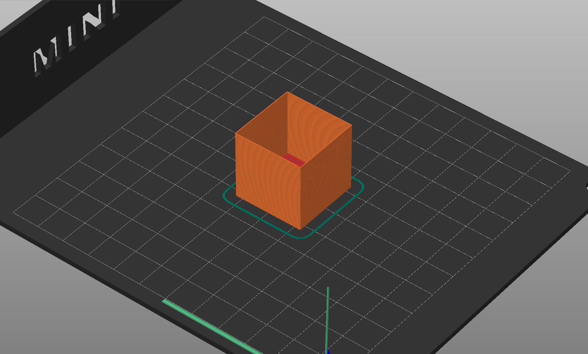

Allow the cube to cool before removing it from the buildplate, then take a pair of calipers and measure the thickness of each wall. I only recommend putting the calipers, at maximum, ~2mm down the sides of the cube to prevent excessive variation from layer wobble. Take the average of your measurements, then divide your line width by that average. This will give the correct flowrate for the tested filament.

Example: Line width is set to 0.45mm. The cube's walls are found to have a line widths of 0.45, 0.47, 0.48, and 0.46, respectively. The average of those line widths is equal to:

$$Average=(0.45+0.47+0.48+0.46)/4$$

$$Average=0.465mm$$

To find the needed flowrate multiplier, divide the original line width by the found average:

$$Flowrate=0.45/0.465$$

$$Flowrate=~0.968$$

This would be the new flowrate multiplier for your filament. If you notice underextrusion issues in your prints, try increasing your multiplier by 0.01.

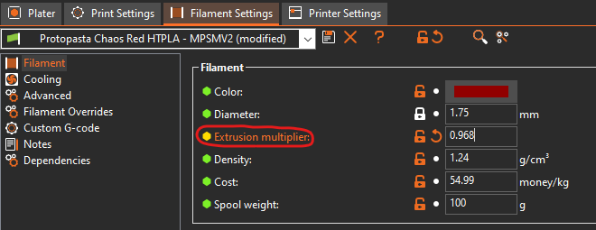

- +-2% flow rate is negligible due to variation of filament diameter. In other words, if your result returns a number between 0.98 and 1.02, don't change your flow rate, it will cause more problems than it will solve.

## **Retraction Test**

- If you haven't noticed any problems with stringing, and don't notice any in the Fan Speed Test, this step can be skipped. Generally, with a good direct drive setup, the only filaments that will need a different retraction value are very soft flexible filaments and exotic filaments such as Carbon Fiber filled PLA.

Take the config that you have been using so far, and export it from PrusaSlicer. 
    
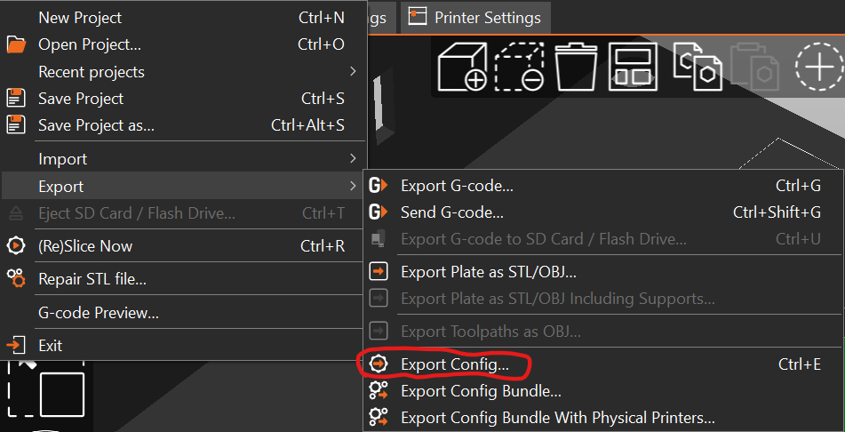
    
Import it into SuperSlicer and save it. Now, use the built in Retraction Calibration that SuperSlicer has to determine the retraction needed for your particular filament. Read through the prompt that appears when you set up the test, it will tell you everything that you need to know to preform it.

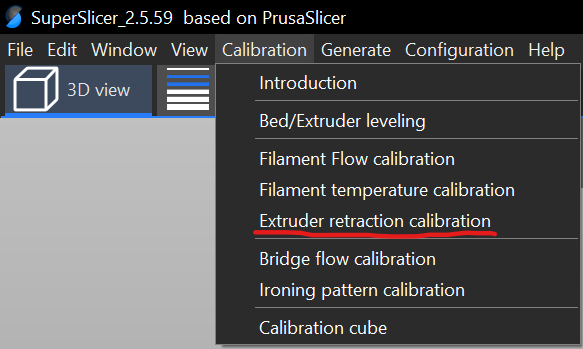

## **Fan Speed Test**

- This test was designed by Abyss on Printables! Go check it out here: [Ultimate Fan Speed Test V3](https://www.printables.com/model/200347-ultimate-fan-speed-test-v3)

**Note:** Fan speed is generally forgiving. If you are getting worse results than expected you can raise or lower any of the fan speeds you set in this step. This step always gets me perfect fan speeds, but it may take some practice before you gain a feel for how to choose settings with this method. Essentially, you're not locked in to what you choose, just use it as a guideline.

- Import [Ultimate_Fan_Test_v3_ABYSS.stl](Tuning-Models/Ultimate_Fan_Test_v3_ABYSS.stl) into your slicer. Use a 0.2mm layer height and change your cooling settings to the following.

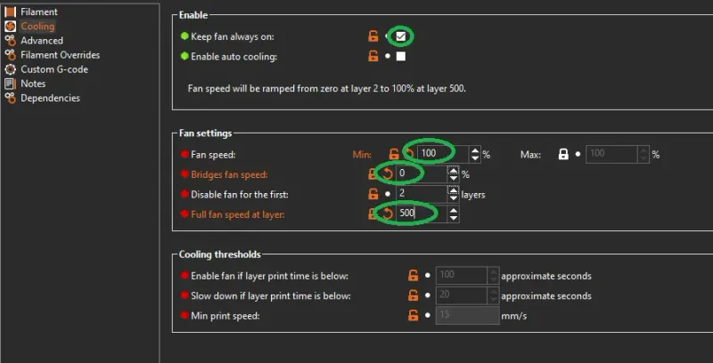

This will cause your fan to spin progressively faster as the model is printed, starting at 0% fan speed and ending at 100% fan speed. When the model is finished, take a look at each marked bar and the area above it. Choose the lowest fan speed that gives good results as your minimum fan speed. Generally, no curling and decent to good looking bridges are what to look at for this setting. Look at the bridging sections and choose the one that looks the best to you, that is your bridging fan speed.

You may want to take a picture of your model, because the next step involved intentionally breaking it apart. Start from the top of the model and work your way down, breaking it apart section by section. The sections will get harder to break apart as the fan speed at the point in the model gets lower. As you break it apart, feel for where the model gets harder to snap. There should be a point where it doesn't get any harder, and that is where your maximum layer adhesion is achieved. Take note of the highest fan speed at which the model has the same resistance to breaking as your chosen minimum fan speed. Set this fan speed to your maximum fan speed.

## **Minimum Layer Time Test**

- Uses [Minimum-Layer-Time-Test.3mf](Tuning-Models/Minimum-Layer-Time-Test.3mf)

Set your minimum layer time to 5 seconds and print this model. If the outer walls of the print curl up, increase the minimum layer time by two seconds. Print the model again with the new minimum layer time setting and check if there is any curling. Repeat this process until the walls print flat. Whatever you minimum layer time is at that point is the ideal value for that setting.

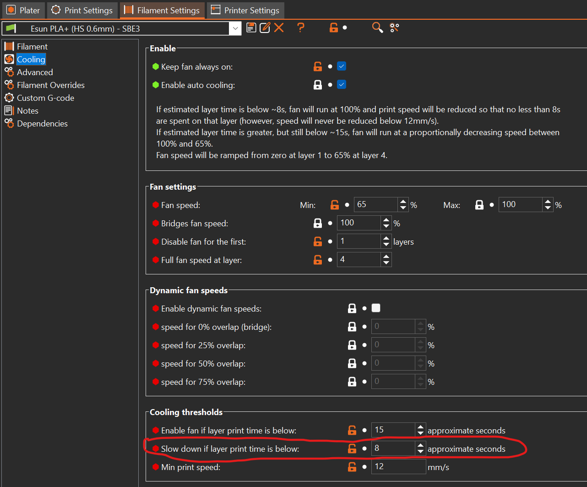

**Note:** For some filaments, there may not be a minimum layer time value that will completely eliminate curling. If this is the case, you can try lowering your printing temperature by a few degrees or upgrading your cooling setup. Otherwise, just choose the setting that gives the best results, even if they aren't perfect.

## **Minimum Layer Speed Test**
- Uses [Minimum-Layer-Speed-Cone.stl](Tuning-Models/Minimum-Layer-Speed-Cone.stl)

I recommend printing 5 copies of this model set at the following minimum layer speeds, `15 mm/s, 12 mm/s, 10 mm/s, 8 mm/s, 5 mm/s, and 3 mm/s`. Label each of the models as you print with a sharpie or other method, so that you do not forget which one is which. Put the printed models side by side and compare them to see which has the least amount of deformed plastic at the top of the model. Set this speed as your minimum layer speed.

**Note:** The upper 5 mm or so of this model will never look perfect as it is unresonable to expect that kind of accuracy from a 0.4mm nozzle. Once you find a speed that you are happy with, save it, set it, and forget it. Going too low in speed will cause problems seen at higher speeds to creep back in. This happens because the nozzle has more time in contact with a specific layer at slower speeds, eventually causing it to heat the filament more than the extra cooling can compensate for. 

The sweet spot can be found where the nozzle is moving slow enough to allow the part cooling to work effectively, but fast enough that the nozzle is not reheating the filament after it has been deposited.

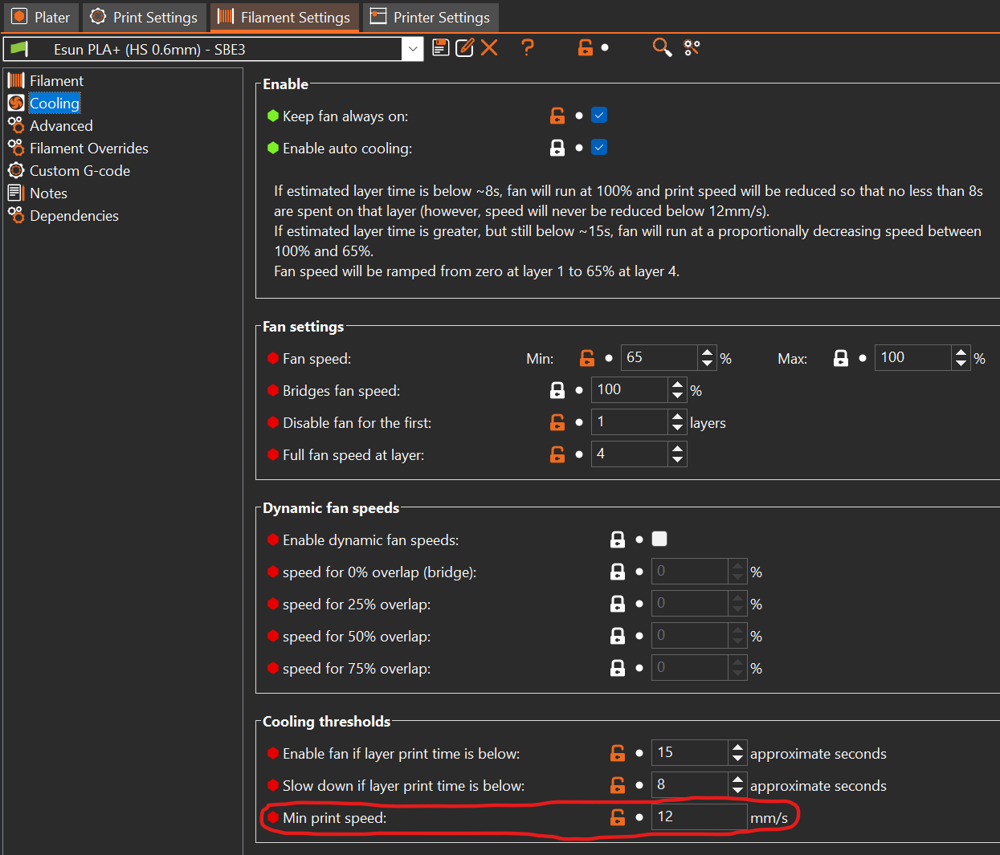

## **Validate Results**
- Print a [Voron Cube](Tuning-Models/Voron_Design_Cube_v7.stl) to validate bridging and corner accuracy.
- Print a [Cali Dragon](Tuning-Models/Cali-Dragon_v1.stl) to validate small detail quality, layer quality, and cooling characteristics.

# Optional (but still recommended) Steps

## Material Expansion/Contraction Calibration

- Finding this setting is useful for using filaments such as ABS. It is worth noting however, that well designed parts such as things designed by the Voron Team have been designed with shrinkage already in mind. This means that if you were to use your expansion settings on those parts, they would be printed incorrectly.

- If the x, y, and z give different percentages of shrinkage, you will want to scale your parts by those three values in each of their respective axes. Filaments don't always scale exactly the same in all axes.
- Some brands like ProtoPasta provide datasheets for their High Temp filaments that give scaling factors for annealing. I recommend following those first for those filaments and testing your results, then following this section with those compensations already put in place **ONLY** if you have problems. Chasing perfection with this kind of process will only lead to disappointment.

Start by slicing a 25x25x25mm cube in your slicer on your normal settings. Print this cube in PLA or another control filament that doesn't shrink or expand much.

Measure the length, width, and height of the cube with calipers. Now, slice another 25x25x25mm cube and print it in the filament you are testing. Measure the length, width, and height of this cube, and compare it to the control cube.

Divide the control cube's length, width, and height by the test cube's length, width, and height. Take those three values and average them. This is the value by which you will want to scale all models printed in that filament to maintain the intended dimensional accuracy. An example of this can be seen below.

$$ControlCube=25.1mm*25.2mm*25mm$$

$$TestCube=24.8mm*24.8mm*24.8mm$$

Now, find the average of the x, y, and z directions:

$$average_x=(25.1/24.8)=1.012$$

$$average_y=(25.2/24.8)=1.016$$

$$average_z=(25/24.8)=1.008$$

$$average=(1.012+1.016+1.008)/3$$

$$average=1.012$$

In this example, this is the expansion multiplier you would use for the test filament. If your slicer scales in percentages, that answer translates into 101.2%.

## Retraction and Unretraction Speed Tuning

- **Note for geared extruders:** There is a point, typically from 40-50 mm/s, where your extruder will start skipping steps on retraction. If you find that you are needing speeds this high, consider drying your filament or retuning retraction. If you still go ahead with those speeds, sit and watch your printer while the test prints and listen for the extruder motor skipping steps.

- Typically the retraction/unretraction speed that your printer ships with is good for printing with. This is one of those settings that makes a relatively small difference once you get past settings that are too slow.

- After completing this tuning, it is a good idea to go back and retune your retraction distance. I have had my retraction distance change by as much as 2mm after doing this tuning on bowden printers.

Once you have completed the [Retraction Test](#retraction-test) portion of this guide, you may also tune your Retraction and Unretraction speeds. This will be achieved through the use of [Teaching Tech's 3D printer calibration website](https://teachingtechyt.github.io/calibration.html#retraction).

Navigate to the "Retraction Tuning" tab, if the hyperlink above does not take you there. Once there, scroll down until you see the "Retraction" section. Once there change your Retraction distancee to what you are currently using for all heights. Then increment your Retraction and Prime (unretract) speeds in increments of 5 as seen in the picture below.

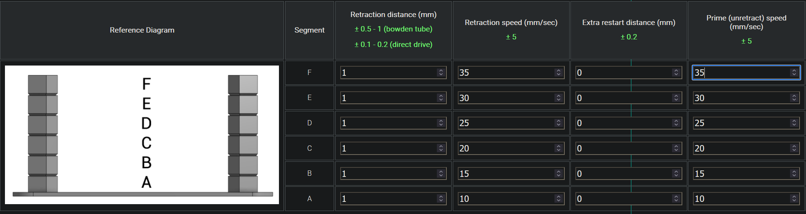

Change the rest of the settings in the tool to match what you use on your printer, and then export the gcode. **MAKE SURE TO CHECK THIS GCODE BEFORE RUNNING IT**. Using your slicer's gcode viewer is a good way to do this. I generally don't like using external gcode creation websites, because it is easy to put in a wrong setting and cause your printer to do something unwanted.

Run the print and mark what speed gives you the best results. If desired, the retraction and unretraction speed can be tuned separately to give you more accurate results.

## TMC Register Tuning

Still in the process of researching this.

## VFA Tuning Tests

Still in the process of researching this.

# Troubleshooting Results

## Validation Model Issues

