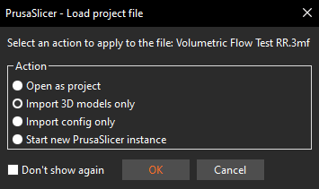
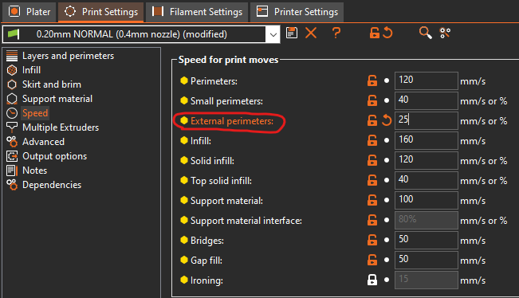
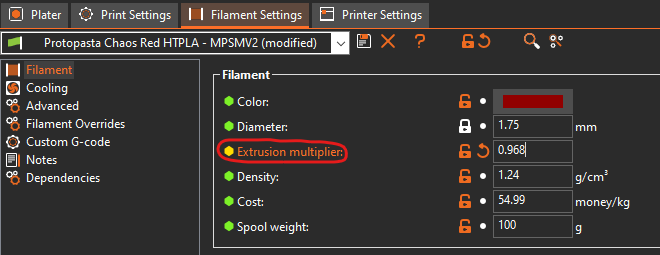
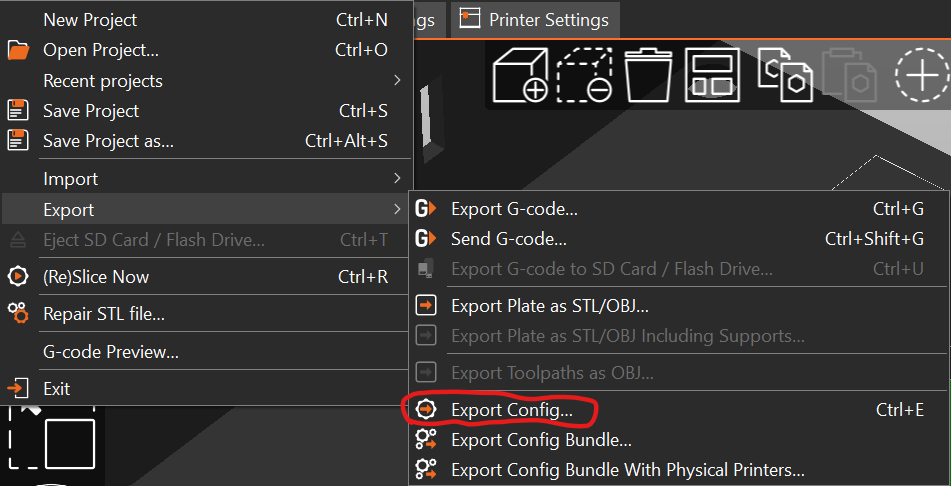
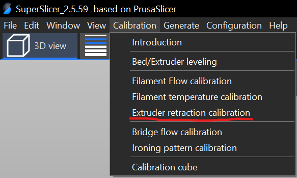
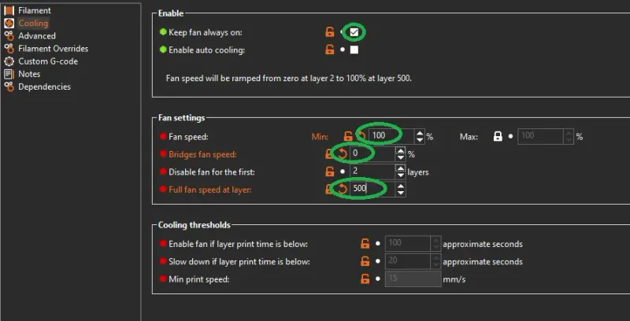

# The Ultimate Filament Tuning Guide

## How to tune 3D printer filaments to perfection!

This guide details how I tune in my 3d printing filaments. It takes approximately 60-70 grams of filament and a few hours of time, including print times. If your printer profiles are tuned in properly, following this guide will give you the best settings possible for your various filaments. This is NOT a guide on how to fine tune your printer's motion system and settings, for that, please see [Ellis' Excellent Print Tuning Guide](https://ellis3dp.com/Print-Tuning-Guide/). My flowrate calibration method does not agree with his, however I am more interested in the dimensional accuracy of my parts rather than their looks.

This guide assumes that you are using Klipper firmware, but everything except for the probe calibration method is transferrable to any other 3D printer firmware. It also assumes that your are using PrusaSlicer, however, most, if not all, of these settings can be found in other slicers, although they may have slightly different names.

All needed models and .3mf files are included in the [Tuning Models](Tuning-Models) folder. The guide will detail which model to use for each test. I highly recommend following the Mandatory Steps section of the guide in order, as it will give the least variation in results, but you may follow this guide in whatever order you choose.

I have found that, occasionally, I have set the Linear Advance factor to a value that is either too high or too low, and have needed to preform the Linear Advance Test a second time to get good results. If you notice slight problems that can be attributed to a wrong interpretation of a test's results, I recommend finishing the entirety of the [Mandatory Steps](https://github.com/Sgail7/The-Ultimate-Filament-Tuning-Guide#mandatory-steps) section, and then going back and fixing the issue. Doing this prevents any untuned variables from skewing your retests, and means that once you fix the problem, then everything is done and you can move on to printing!

# THE GUIDE

### First Time Steps

1. **First Layer Calibration**
    

    
Click here for Procedure

    If using an automatic bed probe, first follow the klipper docs for [Probe Calibration](https://www.klipper3d.org/Probe_Calibrate.html).

    If your printer has bed leveling springs, run the `BED_SCREWS_ADJUST` command and use either a 0.10 mm feeler gauge or a sheet of A4 paper to adjust the bed to be in parallel with the gantry. Do this even if you have an automatic leveling probe installed.

    The above have been completed, make a cube in your slicer. Scale it to approximately half of the total size of your bed, then unlock the scaling and change the z height to be equal to the height of your first layer. Run the print while sitting infront of your printer. As the print progresses, use the babystepping feature found in your web interface to iteratively raise or lower the bed until your layer lines look perfect. Once you reach a point you are happy with you can either let the print complete or cancel the print. Pull the layer of filament off of the bed and inspect the underside to make sure that your final adjustment is correct. Run `Z_OFFSET_APPLY_PROBE` then `SAVE_CONFIG` to save your new z-offset.

    

2. **Elephant's Foot Compensation**
    - This isn't so much of a step as it is something that I just recommend doing. Elephant's foot compansation shrinks the first layer by the amount specified in the x and y axes so that your first layer squish doesn't artifically create a bigger-than-wanted footprint on the bed. I set this value at 0.1 mm to start. Typically it sits somewhere between 0 mm and 0.2 mm. I wouldn't recommend going above 0.2 mm unless you have a leveling problem, in which case you should redo the above step. If you make the elephant's foot compansation value too big, you may cause the first layer to be too small, preventing good layer stacking on top of it. You can read more about this feature [here](https://help.prusa3d.com/article/elephant-foot-compensation_114487).
    
3. **Infill/Perimeter Encroachment Test**
    - *File to be created*
    

    
Click here for Procedure

    Import {file} into your slicer. Make sure that there is at least two layers of infill between the top and bottom solid layers. Print out the file and check for gaps and pin holes at the edge of the top layer. The best value for your Infill/Perimeter overlap is where these gaps and holes disappear, but there is not over extrusion in the corners of the cube.

    Pictures will come :)

    **Note**: Bigger nozzles usually have more difficulty closing these gaps. I recommend checking [this section of ellis' print tuning guide](https://ellis3dp.com/Print-Tuning-Guide/articles/infill_perimeter_overlap.html) for more solutions.

    

    
4. **Bridge Flow Rate Calibration Test**
    - Uses [Bridge-Flow-Tuning.stl](Tuning-Models/Bridge-Flow-Tuning.stl)
    

    
Click here for Procedure

    This calibration should only be done after you have calibrated your fan speed and have figured out what a good bridging speed for your printer is. Make sure that your bridging still suffers even on 100% fan speed before using this feature. If you are satisfied with the bridging performance and dimensional accuracy of holes, skip this step, otherwise do the following.

    Import [Bridge-Flow-Tuning.stl](Tuning-Models/Bridge-Flow-Tuning.stl) into your slicer. Simply print the file as is for a control test. You should see a result that looks like this:

    Picture to come :)

    Decrease your bridge flow rate by 0.1 until you no longer have this drop of filament.

    Slicer picture to come

    Your final result should look something like this:

    Another picture to come

    **Note**: You will have to test this for every layer height profile that you have for your printer. Since different volumetric amounts are output at different layer heights, the amount of bridge flow rate reduction needed will vary. Generally, more is needed for larger layer heights, and less is needed for smaller layer heights. You are trying to get away with as little flow reduction as possible. Going too low on the multiplier may cause poor support for the layers on top of it or, in extreme cases, a breaking of the filament flow, causing the bridge to fail entriely (you will have to really try to do this).

    

### Mandatory Steps

1. **Temperature Test**
    

    
Click here for Procedure

    Set Hotend 10 C below the lowest recommended temperature on the spool. Unlatch extruder and set hotend to 10 C higher than the highest recommended temperature on the spool. Start slowly pushing filament by hand through the hotend at the same time, keeping as near constant pressure as possible. Watch the temperature as you push the filament, you should notice that the filament gets noticably easier to push as the temperature hits certain numbers. Once the hotend has gotten up to the final temperature, choose which of those temperatures that it got easier to push at to use. Generally, the best temperature is somewhere in the middle of the recommended temperatures on a standard 0.4mm brass nozzle, however, this is not a steadfast rule. Hardened steel nozzles tend to need to run about 10-15 C hotter than brass.

    

2. **Volumetric Flowrate Test**
    - Uses [Volumetric-Flow-Test-RR.3mf](Tuning-Models/Volumetric-Flow-Test-RR.3mf)
    - This test was designed by Yathani on Printables! Go check it out here: [Volumetric Flow Test for RatRig V-CORE3](https://www.printables.com/model/328223-volumetric-flow-test-for-ratrig-v-core3)

    

    
Click here for Procedure

    Import the file into PrusaSlicer, making sure to select "Import 3D models only". Turn on Spiral Vase mode as well. 

    

    This test works by increasing your printer's feedrate by 100% every 5 mm in z-height. For a standard flow hotend, you'll want to step up in 2 mm3/s increments; for high-flow hotends, you'll want to step up 2-5 mm3/s increments, depending on the advertised maximum flowrate of your hotend. The final volumetric flowrate will be 12 times the starting flowrate.

    Volumetric flow rate can be calculated as $`VFR=Layer height*Layer width*Layer Speed`$. Because layer height and layer width stay constant during a print, we want to change the layer speed of the external perimeters to control the volumtric flowrate of the test. Rearranging the equation, and using 2 mm3/s as the target volumtric flow rate, we can find our needed external perimeter speed for this print.

    $$Layer Speed=2/(Layer width*Layer height)$$

    Using a 0.4mm layer width with a 0.2mm layer height as an example, we obtain this answer

    $$Layer Speed=2/(0.4*0.2)$$

    $$Layer Speed=25mm/s$$

    Set your external perimeter speed to the value you obtain, and run the print. If you feel that the final volumetric flow rate is far past the limit of your hotend, you can scale the model in only z-height in PrusaSlicer to obtain a lower final volumetric flow rate.

    

    Once this test is completed and your printer is cooled, I highely recommend either restarting the printer, or, if using Klipper, issuing a `FIRMWARE_RESTART` command. The increased feedrate is not reset at the end of the print, **YOU WILL FORGET AND IT MAY CAUSE DAMAGE TO YOUR PRINTER**.

    

3. **Linear Advance Test**
    - Follow the klipper documentation for this and use [square_tower.stl](Tuning-Models/square_tower.stl)
    - [Klipper Pressure Advance Documentation](https://www.klipper3d.org/Pressure_Advance.html)

4. **Flow test**

    

    
Click here for Procedure

    Create a 25mmx25mmx25mm cube in your slicer. Set your slicer to vase mode, and take note of your external perimeter line width. You should be printing an object similar to the following.
    
    

    Allow the cube to cool before removing it from the buildplate, then take a pair of calipers and measure the thickness of each wall. I only recommend putting the calipers, at maximum, ~2mm down the sides of the cube to prevent excessive variation from layer wobble. Take the average of your measurements, then divide your line width by that average. This will give the correct flowrate for the tested filament.

    Example: Line width is set to 0.45mm. The cube's walls are found to have a line widths of 0.45, 0.47, 0.48, and 0.46, respectively. The average of those line widths is equal to:

    $$Average=(0.45+0.47+0.48+0.46)/4$$

    $$Average=0.465mm$$

    To find the needed flowrate multiplier, divide the original line width by the found average:

    $$Flowrate=0.45/0.465$$

    $$Flowrate=~0.968$$

    This would be the new flowrate multiplier for your filament. If you notice underextrusion issues in your prints, try increasing your multiplier by 0.01.

    

    - +-2% flow rate is negligible due to variation of filament diameter. In other words, if your result returns a number between 0.98 and 1.02, don't change your flow rate, it will cause more problems than it will solve.

    

5. **Retraction Test**
    - If you haven't noticed any problems with stringing, and don't notice any in the Fan Speed Test, this step can be skipped. Generally, with a good direct drive setup, the only filaments that will need a different retraction value are very soft flexible filaments and exotic filaments such as Carbon Fiber filled PLA.

    

    
Click here for Procedure

    Take the config that you have been using so far, and export it from PrusaSlicer. 
    
    
    
    Import it into SuperSlicer and save it. Now, use the built in Retraction Calibration that SuperSlicer has to determine the retraction needed for your particular filament. Read through the prompt that appears when you set up the test, it will tell you everything that you need to know to preform it.

    

    

6. **Fan Speed Test**

    - This test was designed by Abyss on Printables! Go check it out here: [Ultimate Fan Speed Test V3](https://www.printables.com/model/200347-ultimate-fan-speed-test-v3)

    

    
Click here for Procedure

    - Import [Ultimate_Fan_Test_v3_ABYSS.stl](Tuning-Models/Ultimate_Fan_Test_v3_ABYSS.stl) into your slicer. Use a 0.2mm layer height and change your cooling settings to the following.
    
    
    
    This will cause your fan to spin progressively faster as the model is printed, starting at 0% fan speed and ending at 100% fan speed. When the model is finished, take a look at each marked bar and the area above it. Choose the lowest fan speed that gives good results as your minimum fan speed. Generally, no curling and decent looking bridges are the best things to look for for this setting. Then look at the bridging sections and choose the one that looks the best to you, that is your bridging fan speed. Set your maximum fan speed to somewhere between these two values. Be careful of setting it too high as strong cooling setups will decrease layer adhesion if run too fast when not needed.

    

7. **Minimum Layer Time Test**
    - Uses [Minimum-Layer-Time-Test.3mf](Tuning-Models/Minimum-Layer-Time-Test.3mf)

    

    
Click here for Procedure

    - Set your minimum layer time to 5 to start, and print this model. If there is curling on the walls, increase the time by two seconds until there isn't curling anymore. The setting where there isn't anymore curling is your new minimum layer time setting.

    

8. **Minimum Layer Speed Test**
    - Uses [Test_Pieces_Cone-10mm-Tall.stl](Tuning-Models/Test_Pieces_Cone-10mm-Tall.stl)

    

    
Click here for Procedure

    - Set your minimum layer speed to 15mm/s. Print out this file. If the plastic looks excessively melted, lower the speed by 3 mm/s. The upper 5 mm or so of this model will never look perfect as it is unresonable to expect that kind of accuracy from a 0.4mm nozzle. Once you find a speed that you are happy with, save it. Be careful of going too low in speed, as it will cause problems to creep back in. If the nozzle is moving too slowly, it sits above one spot for too long, reheating the filament and causing the same issues as running too fast.

    

9. **Validate Results**
    - Print a [Voron Cube](Tuning-Models/Voron_Design_Cube_v7.stl) to validate bridging and corner accuracy
    - Print a [Cali Dragon](Tuning-Models/Cali-Dragon_v1.stl) to validate small detail quality, layer quality, and cooling characteristics

### Optional (but still recommended) Steps

9. Material Expansion/Contraction Calibration
    

    
Click here for Procedure

    

    
10. Also include manual bed leveling with feeler gauges and probe calibration.
    

    
Click here for Procedure

    

    
11. Include something about tuning retraction and un-retraction speeds with the stringing-test model included.
    

    
Click here for Procedure

    

    
12. VFA Tuning Tests
    - 
    - 
    

    
Click here for Procedure

    

    
13. 
14. 
15. 